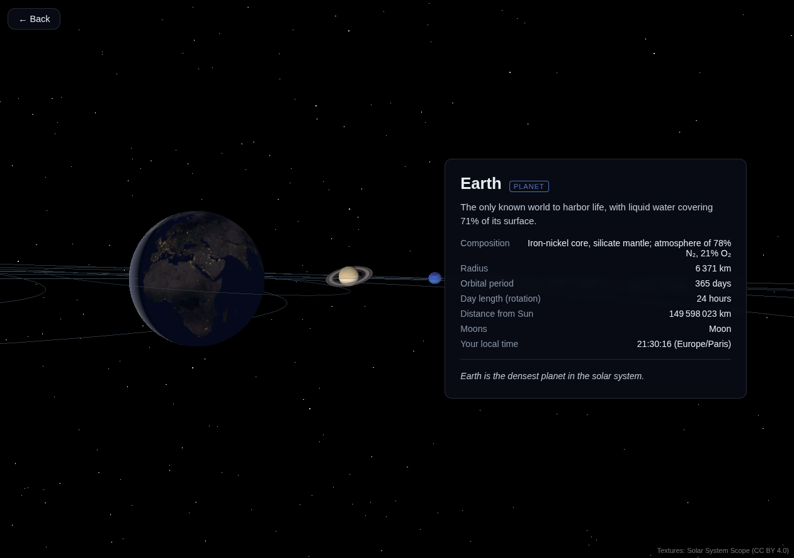

# solar-3d

An interactive 3D model of the solar system, rendered in the browser with Three.js.
Body positions are **real**: a small Express API computes where each planet and moon
actually is on its orbit (from Keplerian elements) for the current date, and the
frontend animates everything forward from there.

- Full-window starfield, a glowing Sun, and the 8 planets on their real current orbital positions.
- Click a planet to fly the camera to it: its major moons appear and an info panel shows facts about the body.
- Responsive focused view (3D on one half, info card on the other), continuous animation, real textures.
- Fully standalone — all textures are committed to the repo; the running app makes zero non-localhost requests.

## Screenshot


<!-- Placeholder: capture the system view and save it as docs/screenshot.png -->

## Quick start

```bash
pnpm install
pnpm download-textures   # one-shot: downloads the 11 texture files into apps/frontend/public/textures
pnpm dev                 # backend on :3001, frontend on :5173 (proxies /api → 3001)
```

Open http://localhost:5173.

## Scripts

```bash
pnpm test        # vitest, all packages
pnpm lint        # eslint, all packages
pnpm typecheck   # tsc --noEmit, all packages
```

## Project layout

| Path | Package | Contents |
|---|---|---|
| `packages/shared` | `@solar/shared` | Shared API DTO types |
| `apps/backend` | `@solar/backend` | Express API, `/api/bodies`, Kepler ephemeris |
| `apps/frontend` | `@solar/frontend` | Vite + React + Three.js (layers: domain / three / api / react) |

The full written specification lives in [docs/](docs/).

## Attribution

Textures: Solar System Scope (CC BY 4.0) — https://www.solarsystemscope.com/textures/

Pluto & Charon maps (S28): New-Horizons-based community texture maps —
*Pluto Texture Map (Fixed Blur Unmaped Areas)* by 4stron4omi4 and
*Charon Texture Map Mixed* by bob3studios (DeviantArt). Underlying imagery: NASA/JHUAPL/SwRI.
