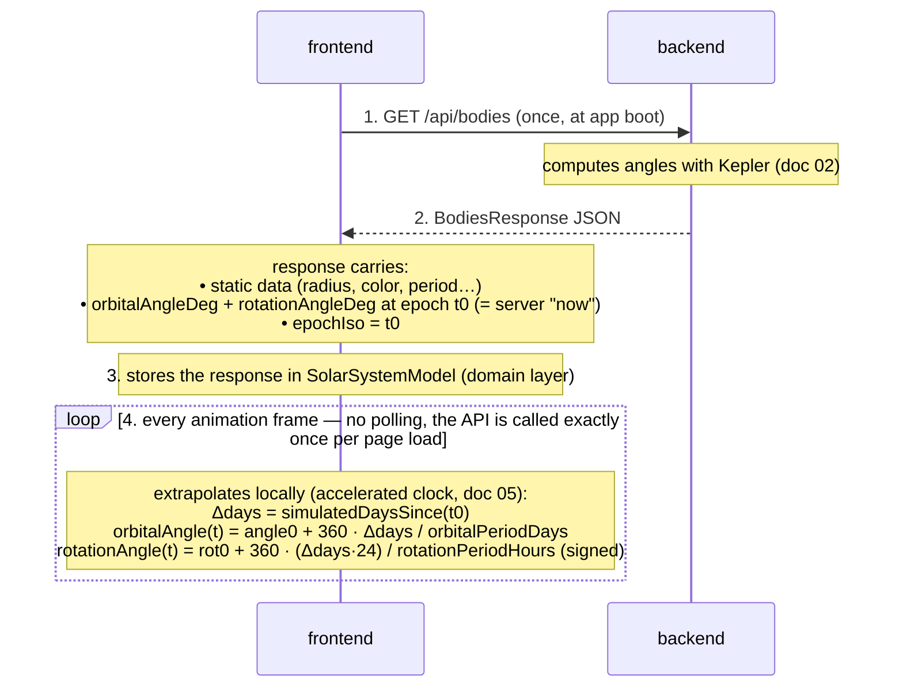

# 01 — Architecture & Tooling

## Monorepo layout

pnpm workspace with two apps and one shared package:

```
solar-3d/
├── CLAUDE.md
├── docs/
├── package.json              # root: scripts + devDeps shared tooling
├── pnpm-workspace.yaml
├── tsconfig.base.json        # shared compiler options, packages extend it
├── .gitignore                # node_modules, dist, .env — do NOT ignore apps/frontend/public/textures
├── scripts/
│   └── download-textures.mjs # one-shot dev script (see doc 08)
├── packages/
│   └── shared/               # @solar/shared — API DTO types only (zero runtime code)
│       ├── package.json
│       ├── tsconfig.json
│       └── src/
│           ├── index.ts
│           └── bodies.ts     # BodyDto, BodiesResponse, BodyType…
└── apps/
    ├── backend/              # @solar/backend — Express API
    │   ├── package.json
    │   ├── tsconfig.json
    │   └── src/              # layout detailed in doc 02
    └── frontend/             # @solar/frontend — Vite + React + Three.js
        ├── package.json
        ├── tsconfig.json
        ├── index.html
        ├── public/
        │   └── textures/     # committed assets (doc 08)
        └── src/              # layout detailed in doc 04
```

### pnpm-workspace.yaml

```yaml
packages:
  - "apps/*"
  - "packages/*"
```

### Package names and dependencies

| Package | Name | Depends on |
|---|---|---|
| `packages/shared` | `@solar/shared` | — (types only, no runtime deps) |
| `apps/backend` | `@solar/backend` | `@solar/shared` (workspace:\*), `express`, `cors`, `winston` |
| `apps/frontend` | `@solar/frontend` | `@solar/shared` (workspace:\*), `react`, `react-dom`, `three` |

`@solar/shared` is consumed **as TypeScript source** (its `main`/`exports` points to `src/index.ts`). No build step for it; both apps' bundler/runtime compile it. This avoids build-order problems for a POC.

## Root package.json scripts

```jsonc
{
  "scripts": {
    "dev": "concurrently -n api,web -c blue,green \"pnpm --filter @solar/backend dev\" \"pnpm --filter @solar/frontend dev\"",
    "build": "pnpm -r build",
    "test": "pnpm -r test",
    "lint": "pnpm -r lint",
    "typecheck": "pnpm -r typecheck",
    "download-textures": "node scripts/download-textures.mjs"
  }
}
```

`concurrently` is a root devDependency.

## Tooling versions

| Tool | Version | Notes |
|---|---|---|
| Node | 24 (≥ 24.0.0) | use built-in `fetch` in scripts; add `"engines": { "node": ">=24" }` to the root package.json |
| pnpm | ≥ 9 | |
| TypeScript | ^5.x | `strict: true` everywhere (doc 07) |
| Vite | ^5.x | frontend dev server + build |
| React | ^18.x | |
| three | ^0.160.0 or newer | import addons from `three/examples/jsm/...` |
| Express | ^4.x | |
| Vitest | ^1.x or ^2.x | test runner for **both** apps and shared |
| tsx | latest | backend dev runner (`tsx watch src/server.ts`) |
| ESLint + Prettier | latest | config in doc 07 |

## Ports & proxy

- Backend listens on **3001** (`http://localhost:3001`).
- Frontend dev server on **5173** (Vite default).
- Vite proxies `/api` → `http://localhost:3001` so the frontend always calls relative `/api/bodies`:

```ts
// apps/frontend/vite.config.ts
export default defineConfig({
  plugins: [react()],
  server: { proxy: { "/api": "http://localhost:3001" } },
});
```

- Backend still enables `cors()` (harmless, useful if someone hits it directly).

## Runtime data flow



Key consequence for implementers: **the backend gives a snapshot; all motion is computed client-side** in the domain layer from periods. The Kepler math lives only in the backend.

> **ISS exception (v3, S23).** The ISS's elements come from a live TLE, not a static table: at most **once per 24 h** the backend GETs the CelesTrak TLE (native `fetch`, lazy in-memory cache, committed snapshot as offline fallback — doc 02 step E). This is the **only** external request in the whole system; the frontend still calls exactly one origin (`/api`), exactly once per page load. The ISS snapshot in the response is extrapolated client-side like any moon; a page refresh re-anchors it.

## What is NOT in the architecture

- No database, no env-dependent config (hardcode ports above). No cache, except the single in-memory 24 h TLE cache above (no cache library — a module-level variable).
- No Docker, no CI pipeline (out of scope for the POC).
- No shared runtime utilities package — `@solar/shared` contains **types only**. If you feel the urge to share a function, copy it; do not grow the shared package.
