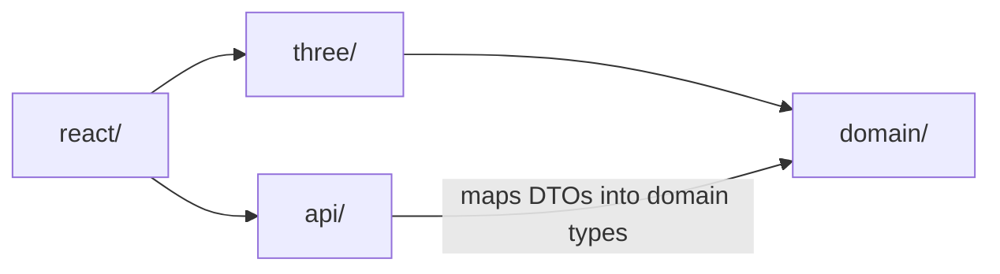
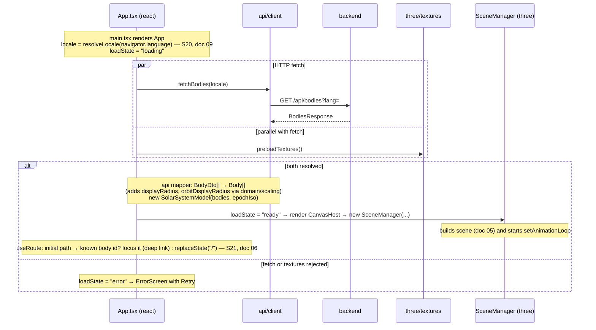
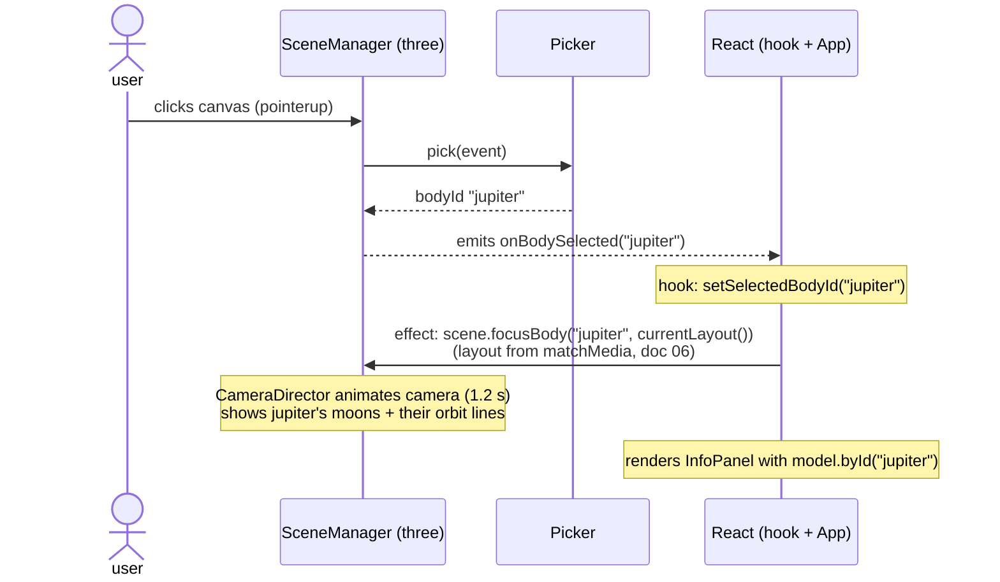
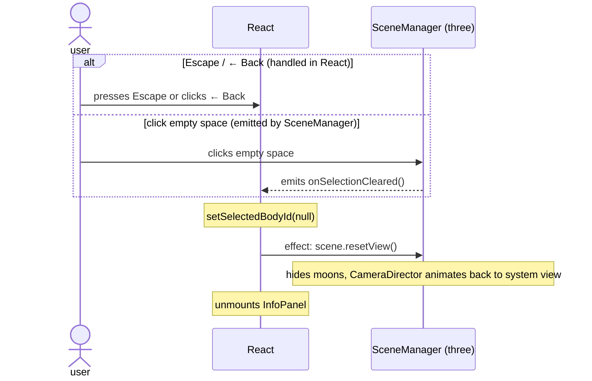

# 04 — Frontend Architecture

The frontend is split into **four layers** with a strict one-way dependency rule. This is the most important structural constraint of the project.



- `domain/` imports **nothing** from `three/`, `react/`, `api/`, or the `three` npm package. Pure TypeScript + `@solar/shared` types only.
- `three/` imports `domain/` and the `three` npm package. **Never** imports React.
- `api/` imports `@solar/shared` and `domain/` (to build domain objects from DTOs).
- `react/` imports everything else. **No file outside `react/` may import `react` or `react-dom`.**
- These rules are enforced by ESLint `no-restricted-imports` (doc 07).

## File layout

```
apps/frontend/src/
├── main.tsx                 # ReactDOM.createRoot(...).render(<App />)
├── api/
│   └── client.ts            # fetchBodies(lang): Promise<BodiesResponse> ; throws ApiError on !ok (lang: doc 09)
├── domain/                  # PURE business logic — fully unit-testable without a browser
│   ├── types.ts             # Body (domain model), ViewMode = "system" | "focused"
│   ├── solarSystemModel.ts  # SolarSystemModel class (see below)
│   ├── scaling.ts           # displayRadius(), orbitDisplayRadius(), moonOrbitDisplayRadius() — formulas in doc 05
│   ├── simulationClock.ts   # SimulationClock class (see below)
│   ├── routes.ts            # S21 — pathForBody(), bodyIdFromPath() (pure URL ↔ body mapping, doc 06)
│   └── i18n/
│       ├── locale.ts        # S20 — Locale, SUPPORTED_LOCALES, resolveLocale() (doc 09)
│       └── strings.ts       # S20 — UI dictionaries + t(locale, key, params?) (doc 09)
├── three/                   # everything that touches WebGL
│   ├── SceneManager.ts      # façade — the ONLY class React talks to
│   ├── buildScene.ts        # createStarfield(), createSun(), createBodyMesh(), createOrbitLine(), createSaturnRings()
│   ├── CameraDirector.ts    # OrbitControls wrapper + animated focus/reset transitions
│   ├── Picker.ts            # raycasting: pointer → body id (or null)
│   ├── textures.ts          # preloadTextures(): Promise<Map<string, Texture>> (doc 08)
│   ├── earthNightLights.ts  # applyEarthNightLights(): Earth night-side city lights (doc 05, S14)
│   └── postprocessing.ts    # EffectComposer + UnrealBloomPass setup
└── react/
    ├── App.tsx              # state machine: loading | error | ready
    ├── CanvasHost.tsx       # owns the SceneManager lifecycle (see below)
    ├── InfoPanel.tsx        # focused-view info card (doc 06)
    ├── Hud.tsx              # back button, footer (version + credit + attribution), hints
    ├── NavMenu.tsx          # S21 — top navigation bar: Sun + 8 planets (doc 06)
    ├── useRoute.ts          # S21 — History API ↔ selectedBodyId sync (doc 06; uses domain/routes)
    ├── useSolarSystemScene.ts # the React ↔ Three bridge hook (see below)
    ├── useLayout.ts         # "horizontal" | "vertical" from matchMedia (doc 06)
    └── styles.css           # plain CSS, no framework (doc 06 has the layout rules)
```

## Domain layer contracts

### `Body` (domain/types.ts)

Same shape as `BodyDto` (import field semantics from doc 02) **plus** precomputed display values filled in by the API mapper:

```ts
export interface Body extends BodyDto {
  displayRadius: number;       // scaling.displayRadius(radiusKm, type)
  orbitDisplayRadius: number | null; // planets: orbitDisplayRadius(a); moons: moonOrbitDisplayRadius(parent, index)
}
```

### `SolarSystemModel` (domain/solarSystemModel.ts)

```ts
class SolarSystemModel {
  constructor(bodies: Body[], epochIso: string)
  get bodies(): readonly Body[]
  byId(id: string): Body | undefined
  childrenOf(id: string): Body[]              // moons of a planet, ordered by semiMajorAxisKm
  /** Angular state extrapolated to `simDaysSinceEpoch` after the API epoch. */
  stateAt(id: string, simDaysSinceEpoch: number): { orbitalAngleDeg: number; rotationAngleDeg: number }
}
```

`stateAt` implements exactly (positive-mod as in doc 02):

```
orbitalAngleDeg  = (angle0 + 360 · simDays / orbitalPeriodDays) mod 360     // null-orbit bodies: null/0
rotationAngleDeg = (rot0   + 360 · simDays·24 / rotationPeriodHours) mod 360
```

### `SimulationClock` (domain/simulationClock.ts)

```ts
class SimulationClock {
  constructor(daysPerRealSecond: number)   // always constructed with SIM_DAYS_PER_REAL_SECOND = 2 (doc 05)
  tick(realDeltaSeconds: number): void     // advances internal simDays
  get simDaysSinceEpoch(): number
}
```

Unit tests for `scaling.ts`, `SolarSystemModel.stateAt`, `SimulationClock` are required (see BACKLOG S5/S9; happy-path + mod-360 wraparound), as well as for `routes.ts` and `i18n/` (S20/S21).

## Routing & i18n placement (v2 — stories S20/S21)

Same layering law, applied to the new modules:

- `domain/routes.ts` and `domain/i18n/` are **pure**: no `window`, no `navigator`, no `history`, no React. They take strings in, give strings out — fully unit-tested in the node environment.
- All browser-API access lives in `react/`: `useRoute.ts` is the only file touching `history`/`popstate`/`location`; the locale is resolved once at boot via `resolveLocale(navigator.language)` in the react layer and passed down as a plain value.
- The **`SceneManager` API does not change** for v2: the nav bar and the router reuse the existing `focus(bodyId)` / `reset()` path of `useSolarSystemScene` — to the three layer, a menu click is indistinguishable from a canvas click.
- URL state is *derived from* `selectedBodyId` (single source of truth unchanged): `useRoute` pushes when the selection changes and sets the selection on `popstate`/initial load. Guard against loops (don't push what popstate just applied).

## The React ↔ Three bridge

**Golden rules:**
1. No Three.js object ever enters React state, props, or context.
2. React state holds only serializable UI state: `selectedBodyId: string | null`, `loadState`.
3. Communication Three → React happens through **callbacks registered on SceneManager**; React → Three through **method calls on SceneManager**.
4. The render loop lives in `SceneManager`, driven by `renderer.setAnimationLoop` — never by React renders.

### `SceneManager` public API (the only surface React sees)

```ts
class SceneManager {
  constructor(container: HTMLElement, model: SolarSystemModel, textures: Map<string, Texture>)
  /** callbacks (each returns an unsubscribe function) */
  onBodySelected(cb: (bodyId: string) => void): () => void
  onSelectionCleared(cb: () => void): () => void
  /** commands */
  focusBody(bodyId: string, layout: "horizontal" | "vertical"): void
  resetView(): void
  setFocusLayout(layout: "horizontal" | "vertical"): void  // re-offset camera on breakpoint change
  resize(): void
  dispose(): void   // stop loop, dispose geometries/materials/renderer, remove canvas
}
```

### `CanvasHost.tsx`

```tsx
function CanvasHost({ model, textures, onSelect, onClear }: Props) {
  const ref = useRef<HTMLDivElement>(null);
  const sceneRef = useRef<SceneManager | null>(null);
  useEffect(() => {
    const scene = new SceneManager(ref.current!, model, textures);
    sceneRef.current = scene;
    const off1 = scene.onBodySelected(onSelect);
    const off2 = scene.onSelectionCleared(onClear);
    return () => { off1(); off2(); scene.dispose(); };
  }, [model, textures]);
  // imperative commands flow through a forwarded ref or returned handle — see useSolarSystemScene
  return <div ref={ref} className="canvas-host" />;
}
```

`useSolarSystemScene.ts` wraps this wiring: it exposes `{ selectedBody, focus(id), reset() }` to `App.tsx` and internally calls `sceneRef.current?.focusBody(...)`. Keep `App.tsx` free of Three.js knowledge.

## Sequence diagrams

### App boot



### Click-to-focus



### Back-to-system



## package.json scripts (frontend)

```jsonc
{
  "scripts": {
    "dev": "vite",
    "build": "tsc --noEmit && vite build",
    "test": "vitest run",
    "lint": "eslint src",
    "typecheck": "tsc --noEmit"
  }
}
```

Vitest config: `environment: "node"` is fine — domain and api tests don't need a DOM; do not write tests that instantiate SceneManager (WebGL is untestable here; manual verification per BACKLOG instead).
