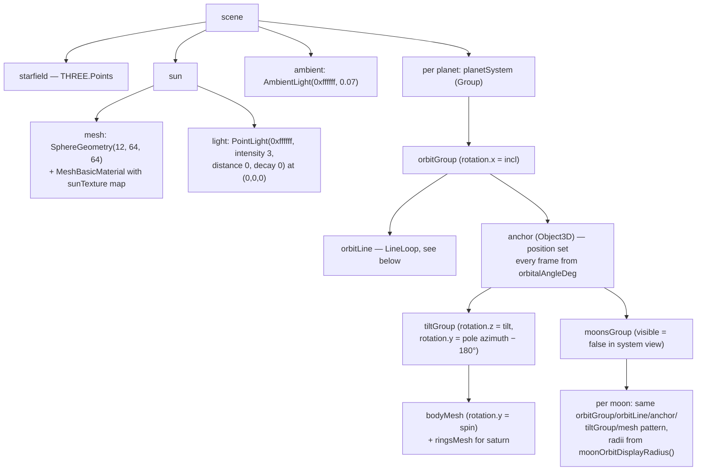

# 05 — Three.js Scene Specification

Every visual/numeric decision is fixed here. Implement the formulas exactly; the "expected result" tables let you sanity-check your output.

## Renderer & global setup

```ts
const renderer = new THREE.WebGLRenderer({ antialias: true });
renderer.setPixelRatio(Math.min(window.devicePixelRatio, 2));
renderer.outputColorSpace = THREE.SRGBColorSpace;
scene.background = new THREE.Color(0x000000);
const camera = new THREE.PerspectiveCamera(55, w / h, 0.1, 5000);
camera.position.set(0, 160, 320);   // initial system view, looking at origin
```

`OrbitControls` (from `three/examples/jsm/controls/OrbitControls`): `enableDamping: true`, `dampingFactor: 0.08`, `minDistance: 15`, `maxDistance: 900`. Call `controls.update()` every frame.

## Coordinate conventions

- The ecliptic is the **XZ plane** (`y = 0`). "Above" = +Y.
- A body with `orbitalAngleDeg = θ` on an orbit of display radius `R` sits at (within its orbit group):
  ```
  x = R · cos(θ·π/180)
  z = −R · sin(θ·π/180)        // minus ⇒ increasing θ is counter-clockwise seen from +Y
  y = 0
  ```
- Orbital inclination: rotate the **orbit group** `group.rotation.x = degToRad(inclinationDeg)`. (We ignore the node longitude Ω — documented simplification. Triton's 157° automatically yields a retrograde-looking orbit.)
- Axial tilt — magnitude **and** direction (S16). A bare `rotation.z` tilt leans the pole toward scene azimuth 180° (−X); the pole must instead lean toward its real ecliptic azimuth `poleEclipticLonDeg` (doc 03 Table 6), otherwise the seasons are phase-shifted (a June Earth renders like a March equinox). With the default Euler order `'XYZ'` and `rotation.x = 0`, Three.js applies the Z tilt first, then the Y yaw — exactly what we need:
  ```ts
  tiltGroup.rotation.z = degToRad(axialTiltDeg);              // lean the pole (toward −X so far)
  tiltGroup.rotation.y = degToRad(poleEclipticLonDeg - 180);  // yaw the lean to its real azimuth
  mesh.rotation.y = degToRad(rotationAngleDeg + 180 - poleEclipticLonDeg); // spin, yaw-compensated
  ```
  The spin compensation `+ 180 − poleEclipticLonDeg` cancels the yaw so the sub-solar-longitude invariant of doc 02 (step D, test 11b) is preserved (within the ~2–3° projection error of spinning around a tilted axis — accepted). For the tilt-0 moons (`poleEclipticLonDeg = 0`) the −180° yaw and the +180° spin compensation cancel exactly — nothing changes for them. The sun has **no** tilt group: its mesh keeps plain `rotation.y = degToRad(rotationAngleDeg)`. Sanity check: near a June solstice, Earth's north pole leans toward the Sun and the arctic is entirely on the lit side.

## Scaling formulas (`domain/scaling.ts`) — the "not to scale but proportional" core

```ts
export const EARTH_RADIUS_KM = 6371;
export const MERCURY_SMA_AU = 0.38709927;

// Per-body display-size correction (S17). The power law alone renders the Moon
// at 0.60× Earth (real ratio 0.27) — visually too big next to Earth.
export const DISPLAY_SIZE_FACTOR: Record<string, number> = { moon: 0.5 };

// Body size: power law compresses the range, proportions stay visible.
// The factor applies to the final (clamped) result; unknown/omitted id → 1.
export function displayRadius(radiusKm: number, type: BodyType, id?: string): number {
  if (type === "star") return 12;
  const base = Math.max(2.5 * Math.pow(radiusKm / EARTH_RADIUS_KM, 0.4), 0.45);
  return base * (id !== undefined ? (DISPLAY_SIZE_FACTOR[id] ?? 1) : 1);
}

// Planet orbit: log scale anchored on Mercury at 35 units.
export function orbitDisplayRadius(semiMajorAxisAu: number): number {
  return 35 + 170 * Math.log10(semiMajorAxisAu / MERCURY_SMA_AU);
}
// (the API gives semiMajorAxisKm — divide by 149_597_870.7 to get au)

// Moon orbit in focused view: linear spread around the parent.
// index = rank of the moon ordered by real semiMajorAxisKm (0 = innermost).
export function moonOrbitDisplayRadius(parentDisplayRadius: number, index: number): number {
  return parentDisplayRadius * (2.2 + index * 1.1);
}
```

### Expected values (assert these in `scaling.test.ts`, tolerance ±0.05)

Body display radii: mercury 1.70, venus 2.45, earth 2.50, mars 1.94, **jupiter 6.52**, saturn 6.06, uranus 4.34, neptune 4.29, sun 12, **moon 0.74** (= 1.49 × the 0.5 `DISPLAY_SIZE_FACTOR`, S17; without the `id` argument: 1.49), ganymede 1.76, titan 1.74, triton 1.35, mimas 0.62, phobos/deimos clamped to 0.45 (the clamp applies before the factor; no factor for them).

Orbit display radii: mercury 35.0, venus 81.2, earth 105.1, mars 136.2, jupiter 226.8, saturn 271.6, uranus 323.2, neptune 356.4.

Moon orbits, e.g. Jupiter (parent 6.52): io 14.3, europa 21.5, ganymede 28.7, callisto 35.9.

## Scene graph



`bodyMesh.userData.bodyId = body.id` on every body mesh — the Picker (doc 06) relies on it.

## Materials & lighting

- Planets/moons: `MeshStandardMaterial({ map: texture, roughness: 1, metalness: 0 })`; if the body has no texture file (doc 08), use `MeshStandardMaterial({ color: body.color, roughness: 1, metalness: 0 })`.
- The single `PointLight` at the sun + low ambient produce the required day/night terminator automatically. **No shadow maps** (`renderer.shadowMap.enabled` stays false).
- Acceptance check: looking at Earth, the Sun-facing side is clearly lit, the opposite side near-black. If the dark side is invisible, raise ambient to max 0.12; if no contrast, lower it — never above 0.15.
- Sphere segments: planets `SphereGeometry(r, 48, 48)`, moons `(r, 32, 32)`.

### Earth night lights (city lights) — story S14

Earth — and **only** Earth — shows the `earth-night.jpg` city lights (doc 08) on its dark hemisphere, masked in the shader so they appear on the night side only and fade out across the terminator. Use `onBeforeCompile` on the existing `MeshStandardMaterial` — no extra mesh, no extra dependency.

**Do not route this through `material.emissive` / `material.emissiveMap`.** The Picker (doc 06) drives `material.emissive` for hover/focus highlighting (`0x222222` on hover, `0x000000` when focused). If the night lights used `emissive` as their carrier, focusing Earth would set it to black and the lights would vanish. Instead, pass the night map as its own `uNightMap` sampler and **add** it to `totalEmissiveRadiance`, so it composes independently of whatever emissive highlight the Picker sets:

```ts
// three/earthNightLights.ts
const NIGHT_INTENSITY = 1.0;
// Returns the per-frame updater; call it once per frame from the animation loop.
export function applyEarthNightLights(
  material: THREE.MeshStandardMaterial,     // must already carry Earth's day `map` (for vMapUv)
  nightTexture: THREE.Texture,              // preload map key "earth-night" (doc 08)
): (earthMesh: THREE.Object3D) => void {
  const uSunDirection = { value: new THREE.Vector3(1, 0, 0) }; // body → sun, world space
  const uNightMap = { value: nightTexture };

  material.onBeforeCompile = (shader) => {
    shader.uniforms.uSunDirection = uSunDirection;
    shader.uniforms.uNightMap = uNightMap;
    shader.vertexShader = shader.vertexShader
      .replace("#include <common>", "#include <common>\nvarying vec3 vWorldNormal;")
      .replace(
        "#include <defaultnormal_vertex>",
        "#include <defaultnormal_vertex>\nvWorldNormal = normalize(mat3(modelMatrix) * objectNormal);",
      );
    shader.fragmentShader = shader.fragmentShader
      .replace(
        "#include <common>",
        "#include <common>\nvarying vec3 vWorldNormal;\nuniform vec3 uSunDirection;\nuniform sampler2D uNightMap;",
      )
      .replace(
        "#include <emissivemap_fragment>",
        `#include <emissivemap_fragment>
        float cosSun = dot(normalize(vWorldNormal), uSunDirection);
        float nightMask = 1.0 - smoothstep(0.0, 0.20, cosSun);
        totalEmissiveRadiance += texture2D(uNightMap, vMapUv).rgb * nightMask * ${NIGHT_INTENSITY};`,
      );
  };

  const tmp = new THREE.Vector3();
  return (earthMesh) => {
    earthMesh.getWorldPosition(tmp);                            // sun is at the world origin,
    uSunDirection.value.copy(tmp).multiplyScalar(-1).normalize(); // so body → sun = −worldPos
  };
}
```

- The mask `1.0 − smoothstep(0.0, 0.20, cosSun)` is **1 over the entire night hemisphere** (`cosSun ≤ 0`) and fades out across a ~11.5° band on the **day side**, where direct sunlight takes over. Keep the edges in this order: GLSL `smoothstep` requires `edge0 < edge1`.
- **Why the fade sits on the day side (S18 bugfix):** the original S14 mask `1.0 − smoothstep(−0.10, 0.10, cosSun)` centered the fade *on* the terminator, so right where the Lambert term reaches zero the city lights were only at ~50 % — neither layer lit a thin band, which rendered as a dark stripe along Earth's terminator (the other planets, having no night layer, never showed it). With the lower edge at `0.0` there is no longer any point where both contributions are low. The upper edge may be tuned within `[0.15, 0.30]` if the hand-off looks abrupt; the lower edge must stay `0.0`. Current value: `0.20`.
- `vMapUv` is the day map's UV varying; it exists because Earth's material carries the base `map`. Only call this when that map is present (it always is — the day texture is committed).
- Reuse `tmp` — the updater runs every frame and must not allocate (same rule as the rest of the loop).
- The night map is color data: it keeps `SRGBColorSpace` (doc 08), so `texture2D(uNightMap, …)` returns linear values, same as any sampled color map.
- Bloom: the night map is mostly near-black and stays below the 0.85 bloom threshold. If the city lights visibly bloom, lower `NIGHT_INTENSITY` to 0.7 — never below 0.5, the lights must remain clearly visible in the focused view.
- If `"earth-night"` is missing from the preload map, **do not call this function at all**: Earth renders exactly as before (graceful-fallback policy of doc 08).

### Saturn's rings

```ts
const inner = saturnDisplayRadius * 1.25, outer = saturnDisplayRadius * 2.35;
const geo = new THREE.RingGeometry(inner, outer, 128);
// Remap UVs radially, otherwise the ring texture renders as a mess (known gotcha):
const pos = geo.attributes.position; const v = new THREE.Vector3();
for (let i = 0; i < pos.count; i++) {
  v.fromBufferAttribute(pos, i);
  geo.attributes.uv.setXY(i, v.length() < (inner + outer) / 2 ? 0 : 1, 1);
}
const mat = new THREE.MeshBasicMaterial({
  map: saturnRingTexture, side: THREE.DoubleSide, transparent: true, opacity: 0.9,
});
const rings = new THREE.Mesh(geo, mat);
rings.rotation.x = Math.PI / 2;      // ring plane = equator plane, inside tiltGroup
```

Add `rings` inside Saturn's `tiltGroup` (so they tilt with the planet), **not** spinning with `bodyMesh`.

### Sun glow (bloom)

`EffectComposer` + `RenderPass` + `UnrealBloomPass(resolution, strength 1.1, radius 0.5, threshold 0.85)` from `three/examples/jsm/postprocessing/...`. Render via `composer.render()` (not `renderer.render`). The emissive sun (MeshBasicMaterial, bright texture) exceeds the threshold and glows; textured planets stay mostly below it. If planets visibly glow, raise threshold to 0.9.

## Orbit lines

```ts
// circle of radius R in the XZ plane, 128 segments
const pts = [...Array(128)].map((_, i) => {
  const a = (i / 128) * Math.PI * 2;
  return new THREE.Vector3(R * Math.cos(a), 0, -R * Math.sin(a));
});
new THREE.LineLoop(
  new THREE.BufferGeometry().setFromPoints(pts),
  new THREE.LineBasicMaterial({ color: 0x445566, transparent: true, opacity: 0.35 })
);
```

Moon orbit lines: same, `opacity 0.25`, only visible in focused view.

## Starfield

```ts
// 3000 uniformly distributed points on a sphere of radius 1800
const positions = new Float32Array(3000 * 3);
for (let i = 0; i < 3000; i++) {
  const u = Math.random(), vv = Math.random();
  const theta = 2 * Math.PI * u, phi = Math.acos(2 * vv - 1);   // uniform on sphere
  positions.set([1800 * Math.sin(phi) * Math.cos(theta),
                 1800 * Math.cos(phi),
                 1800 * Math.sin(phi) * Math.sin(theta)], i * 3);
}
new THREE.Points(geometry, new THREE.PointsMaterial({
  color: 0xffffff, size: 1.2, sizeAttenuation: false,
  transparent: true, opacity: 0.55, depthWrite: false,
}));
```

Subtle is the goal: stars must never compete with the planets.

## Time & animation loop

```ts
// Real-time: 1 simulated day = 86 400 real seconds = 24 real hours
export const SIM_DAYS_PER_REAL_SECOND_SYSTEM = 1 / 86_400;
export const SIM_DAYS_PER_REAL_SECOND_FOCUSED = 1 / 86_400;
```

The simulation runs at real-time speed: Earth takes ~365 real days to complete one orbit, the Moon ~27 real days, etc. The `SimulationClock` (doc 04) integrates `simDays += rate · realDelta`; `SceneManager` switches the rate when entering/leaving focus (the clock keeps its accumulated `simDays` — no jump).

Per frame (`renderer.setAnimationLoop`):

```
delta = threeClock.getDelta()
simClock.tick(delta)
for each planet & visible moon:
  { orbitalAngleDeg, rotationAngleDeg } = model.stateAt(id, simClock.simDaysSinceEpoch)
  anchor.position.set(R·cos, 0, −R·sin)
  bodyMesh.rotation.y = degToRad(rotationAngleDeg + 180 − poleEclipticLonDeg)  // yaw-compensated spin
sun mesh rotation.y = degToRad(rotationAngleDeg)   // no tilt group on the sun → no compensation
updateEarthNightLights(earthMesh)               // S14 — see "Earth night lights"
if focused: cameraDirector.trackFocusedBody()   // see below
controls.update()
composer.render()
```

## CameraDirector

### Focus transition (`focusBody(id, layout)`)

1. Compute every frame during the transition (the planet moves!):
   - `targetPos` = focused body's **world position** (`mesh.getWorldPosition`)
   - `dist = max(outermostMoonOrbitRadius * 1.6, bodyDisplayRadius * 8)`; for the sun or a moon: `bodyDisplayRadius * 8`
   - `endCamPos = targetPos + normalize(currentCamPos − targetPos, but y clamped ≥ 0.25·dist) · dist` — **for Earth this direction is overridden, see "Earth focus direction" below**.
2. Animate over **1.2 s** with ease-in-out-cubic (`t<0.5 ? 4t³ : 1−(−2t+2)³/2`): lerp `camera.position → endCamPos` and `controls.target → targetPos`. Controls disabled during the transition, re-enabled after with `minDistance = dist·0.3`, `maxDistance = dist·4`.
3. **Half-screen placement via view offset** (this is the trick — do not move the target sideways):
   - horizontal layout (desktop): `camera.setViewOffset(w, h, 0.25·w, 0, w, h)` → body renders in the **left** half.
   - vertical layout (mobile): `camera.setViewOffset(w, h, 0, 0.25·h, w, h)` → body renders in the **top** half.
   - If the body lands on the wrong side, flip the offset sign — verify visually once.
4. After the transition, every frame (`trackFocusedBody`): `controls.target.copy(bodyWorldPos)` and translate the camera by the body's frame-to-frame world displacement so the view follows the body on its orbit.
5. Show `moonsGroup` (and moon orbit lines) of the focused planet at transition start; clock rate → FOCUSED.

### Earth focus direction — face the visitor's meridian (S15)

For the **focused body = Earth only**, replace step 1's direction `normalize(currentCamPos − targetPos)` with the outward direction of the visitor's own timezone meridian, so clicking Earth lands the camera in front of *their* region (and, when it is night for them, in front of their S14 city lights). Everything else in the transition — `dist`, the 1.2 s ease, the half-screen view offset (step 3), the moving-target tracking (step 4) — is unchanged; only the direction differs, and only for Earth.

1. **Visitor longitude** (degrees east), from the same browser timezone the InfoPanel surfaces as local time (doc 06): `Lv = −(new Date().getTimezoneOffset()) / 60 × 15`. (`getTimezoneOffset()` is minutes *west* of UTC, hence the minus; Paris in summer → +30°.) Put it in a pure `domain/` function (`visitorLongitudeDeg()`), unit-tested — it touches neither `three` nor React.
2. **Sub-solar longitude** at focus time, from the API state (doc 02 step D, test 11b): `Lss = (orbitalAngleDeg + 180 − rotationAngleDeg) mod 360`, via `model.stateAt('earth', simDays)`. Its meridian faces the Sun — i.e. world direction `dSun = normalize(−P)`, where `P` is Earth's world position (the Sun sits at the origin).
3. **Rotate** `dSun` around world **+Y** by `Δ = Lv − Lss` to get the visitor meridian's outward direction: `dV = makeRotationY(Δ·π/180) · dSun`. Axial tilt is ignored here (documented simplification: it shifts the framed meridian by a few degrees at most). If the camera lands on the wrong meridian, flip the sign of `Δ` and verify once — exactly like the view-offset sign in step 3.
4. `endCamPos = P + dV · dist` — **skip the `y ≥ 0.25·dist` clamp** when a `focusDirection` is provided. The clamp exists to prevent the generic path from going below the ecliptic, but applying it to a near-horizontal meridian direction would push the camera toward the north pole instead of facing the equator.

SceneManager owns this computation (it holds the model and the clock) and passes the resulting world direction into `CameraDirector.focusBody`; React keeps calling `focusBody(bodyId, layout)` with **no** Three.js object crossing the boundary (doc 04 layering). For every other body the focus direction is unchanged.

### Reset (`resetView()`)

Animate 1.2 s back to `position (0,160,320)`, `target (0,0,0)`, `camera.clearViewOffset()`, hide all moonsGroups, clock rate → SYSTEM, restore minDistance 15 / maxDistance 900.

### `setFocusLayout(layout)`

Just re-applies step 3's `setViewOffset` with the new layout (called by React on breakpoint change, doc 06).

## Resize

On `window.resize`: update `camera.aspect` + `updateProjectionMatrix()`, `renderer.setSize`, `composer.setSize`, and re-apply the current view offset if focused.

## Disposal

`SceneManager.dispose()`: `renderer.setAnimationLoop(null)`, traverse scene disposing geometries/materials/textures, `renderer.dispose()`, remove the canvas element, remove window listeners.
