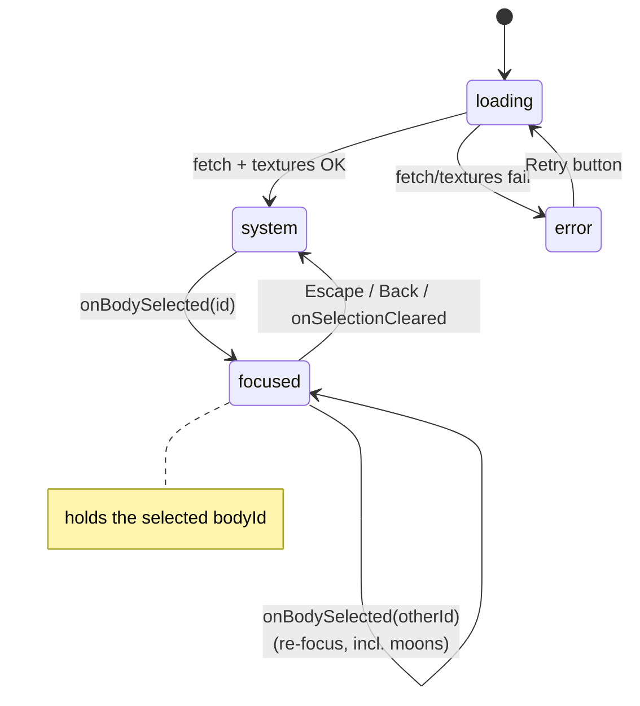

# 06 — Interactions & UI Specification

> **i18n (v2, S20).** Every user-visible string quoted in this doc is the **English** version; at implementation time each one comes from its doc 09 key via `t(locale, key)` (e.g. the hint line is `t(locale, "hint")`). Exceptions that stay identical in all languages: the texture attribution, the version chip, the name `Jynfra` (doc 09 notes).

## Picking (`three/Picker.ts`)

- Raycast on **`pointerup`**, and only if the pointer moved less than 5 px since `pointerdown` (so orbit-dragging never selects).
- `THREE.Raycaster` against the array of body meshes only (keep a flat `pickables: Mesh[]` list — never raycast the whole scene; orbit lines, starfield and rings must not be pickable).
- Hit → `bodyId = mesh.userData.bodyId` → emit `onBodySelected(bodyId)`.
- No hit **while focused** → emit `onSelectionCleared()` (click empty space = exit focus).
- No hit while in system view → do nothing.
- In system view, moons are hidden and therefore not pickable; in focused view the focused planet's moons are pickable.
- Touch: `pointerup` covers tap automatically (Pointer Events). Don't add separate touch handlers.

### Hover (desktop only)

On `pointermove` (throttled to one raycast per frame max): if over a pickable body, set `canvas.style.cursor = "pointer"` and bump the material (`material.emissive.setHex(0x222222)` — only if the material is a `MeshStandardMaterial`; the sun uses `MeshBasicMaterial`, which has no emissive: cursor change only); restore (`0x000000`, cursor `default`) when leaving. The **currently focused body is excluded from the highlight** (hovering it does not bump its emissive — re-focusing it is a no-op anyway); the cursor still changes. Skip hover logic entirely on touch-only devices (`matchMedia("(hover: none)")`).

> The Picker owns `material.emissive` for every pickable `MeshStandardMaterial`, writing `0x222222`/`0x000000` for hover and resetting to `0x000000` on focus. Earth's night lights (doc 05, story S14) therefore must **not** be carried by `material.emissive`/`emissiveMap` — they are added to `totalEmissiveRadiance` through a separate `uNightMap` sampler so the two never collide (focusing Earth, which blacks out `emissive`, must not extinguish the city lights).

## Selection state machine (React, `App.tsx`)



- `selectedBodyId: string | null` is the single source of truth, owned by React.
- Entering focused: effect calls `scene.focusBody(id, layout)`. Leaving: `scene.resetView()`.
- Selecting another body while focused (e.g. clicking a moon): just call `focusBody(newId, layout)` again — the CameraDirector animates from wherever it is. Focusing a **moon** keeps its planet's moonsGroup visible and shows the moon's info panel.
- Clicking the **sun** focuses it like a planet (no moons to show).
- Focusing **Earth** additionally aims the camera at the visitor's own timezone meridian (doc 05, "Earth focus direction", S15) — the same timezone the panel shows as local time. React still just calls `focusBody("earth", layout)`; the meridian math is internal to the three layer.
- Escape key listener: `window.addEventListener("keydown", …)` in a React effect, active only when focused.

## Top navigation bar (`react/NavMenu.tsx`) — story S21

A slim fixed bar along the top edge, visible in **both** view modes (system and focused), above the canvas.

- **Items**: the Sun + the 8 planets, **in system order** (the API order: sun, mercury → neptune). Moons are never in the bar.
- **Labels**: the body's localized `name` from the API (so the bar follows the app language for free).
- **Colors**: each item's text uses its body's `color` (the same hex the InfoPanel badge uses) at full opacity when active/hovered, ~0.75 opacity otherwise.
- **Active state**: the focused body's item is highlighted (brighter + 2 px underline in the body color). When a **moon** is focused, its **parent planet's** item is highlighted. In system view, no item is active.
- **Click** → exactly the same path as a canvas click: `focus(bodyId)` (state machine above). Clicking the active item is a no-op (re-focus rule). Clicks during a camera transition are ignored (same rule as canvas picks).
- **Style**: same glassy family as the card — `background: rgba(10, 14, 24, 0.6); backdrop-filter: blur(6px); border-bottom: 1px solid rgba(255,255,255,0.08);` height 44 px, items centered horizontally, 13 px uppercase labels, `z-index` above canvas (same plane as the HUD).
- **Responsive**: single row, never wraps; on overflow (mobile portrait) the row is horizontally scrollable (`overflow-x: auto`, hidden scrollbar, edge fade). The bar must not cover the Back button: the Back button's fixed position moves down below the bar (top offset = bar height + 8 px).

## URL routing — story S21

The URL pathname always mirrors the focused body — all **29** bodies, moons included. **History API only** (no router dependency — CLAUDE.md rule 7); mapping is pure in `domain/routes.ts`, browser access only in `react/useRoute.ts` (doc 04).

| URL | State |
|---|---|
| `/` | System view (no selection) |
| `/<bodyId>` (e.g. `/earth`, `/mars`, `/sun`, `/moon`, `/titan`) | That body focused |
| any other path (e.g. `/pluto`) | `history.replaceState` to `/`, system view |

Behavior:

- **Selection change → URL**: `history.pushState(null, "", path)` whenever `selectedBodyId` changes and the path differs from `location.pathname`. No push for the change applied *by* a `popstate` handler (loop guard).
- **`popstate` → selection**: parse the path; known id → `focus(id)`, `/` or unknown → `reset()`. Browser back/forward therefore replays the focus history with the usual camera animations, no page reload.
- **Deep link**: on boot, once the model is ready (doc 04 boot sequence), parse `location.pathname`: known id → focus it (normal 1.2 s transition from the system viewpoint), unknown non-`/` → `replaceState("/")`.
- Back/Escape still walk moon → planet → system (state machine above); the URL follows each step (`/moon` → `/earth` → `/`).
- The locale is **not** in the URL (doc 09 — browser language only). No query params, no hash.
- Dev server note: Vite's default SPA fallback already serves `index.html` for `/mars` & co — no config needed.

## Layout & responsiveness

Single breakpoint rule, defined once in `react/useLayout.ts`:

```ts
const isVertical = useMediaQuery("(max-width: 768px), (orientation: portrait)");
const layout = isVertical ? "vertical" : "horizontal";
```

(`useMediaQuery` = small local hook on `window.matchMedia` + change listener.)

- The canvas **always** fills the viewport (`position: fixed; inset: 0`). The InfoPanel overlays it (the 3D never resizes when the panel opens; the view-offset trick from doc 05 does the framing).
- If `layout` changes while focused (rotation, window resize across the breakpoint), an effect calls `scene.setFocusLayout(layout)` and the panel re-renders on the other half.

### Focused view, horizontal (desktop)

```css
.info-panel { position: fixed; top: 0; right: 0; bottom: 0; width: 50vw;
              display: flex; align-items: center; justify-content: center;
              pointer-events: none; }
.info-card  { pointer-events: auto; max-width: 480px; width: 85%;
              max-height: 85vh; overflow-y: auto; }
```

### Focused view, vertical (mobile)

```css
.info-panel { position: fixed; left: 0; right: 0; bottom: 0; height: 50vh;
              display: flex; align-items: flex-start; justify-content: center; }
.info-card  { width: 92%; max-height: 46vh; overflow-y: auto; margin-top: 8px; }
```

Panel mount/unmount animation: fade + 12 px slide (CSS transition, 200 ms). No animation library.

## InfoPanel content (`react/InfoPanel.tsx`)

Card style: `background: rgba(10, 14, 24, 0.82); backdrop-filter: blur(6px); border: 1px solid rgba(255,255,255,0.12); border-radius: 12px; color: #E8EDF4; padding: 24px;`.

Content, top to bottom (all data comes from the `Body` object — no extra fetch):

1. **Name** (h1) + type badge (`star` / `planet` / `moon` — small uppercase chip in the body's `color`).
2. `description` (from `info`).
3. Fact rows (label left, value right; omit a row when the field is null):
   - **Composition** — `info.composition`
   - **Radius** — `radiusKm` formatted `6 371 km`
   - **Orbital period** — humanized: `< 2 days` → `"X hours"`; `< 730 days` → `"X days"`; else `"X years"` (1 decimal, divide by 365.25)
   - **Day length (rotation)** — `rotationPeriodHours` humanized: `< 48 h` → hours, else days (1 decimal)
   - **Distance from parent** — `semiMajorAxisKm` formatted with thin spaces, label "Distance from Sun" for planets / "Distance from <parent name>" for moons
   - **Moons** — for planets with moons: comma-separated names (from `model.childrenOf(id)`)
   - **Your local time** — Earth only: live clock in the visitor's own time zone, ticking every second (`toLocaleTimeString` + `Intl.DateTimeFormat().resolvedOptions().timeZone`), formatted `14:32:07 (Europe/Paris)`. Purely client-side; no astronomical meaning.
4. **Fun fact** — `info.funFact`, italic, separated by a thin rule.

Number formatting helper (domain or react util): integer grouping with narrow no-break spaces (`Intl.NumberFormat("en-US")` then replace `,` — or `useGrouping` with `" "`).

## HUD (`react/Hud.tsx`)

- **Back button**: visible only when focused. Fixed top-left **below the nav bar** (top offset = bar height + 8 px, S21), `← Back`, same glassy style as the card, `z-index` above canvas. Click → clear selection.
- **Hint line**: in system view only, fixed bottom-center, small faded text: `Click a planet to explore — drag to rotate, scroll to zoom`.
- **Footer** (S22): fixed bottom-right, 11 px, opacity 0.45, one line with `·` separators:

  `v2.0 · Made by Jynfra with ❤️ · Textures: Solar System Scope (CC BY 4.0)`

  - **Version chip**: `v` + major.minor of the frontend package version, injected at build time via Vite `define` (`__APP_VERSION__`, see BACKLOG S22). Never hardcode the number in a component.
  - **Credit**: the doc 09 `madeBy` string (localized), with `{author}` = `Jynfra` rendered as a link to `https://jynfra.com` (`target="_blank" rel="noopener noreferrer"` — user-initiated navigation, not an app fetch, so CLAUDE.md rule 5 is untouched).
  - **Attribution**: `Textures: Solar System Scope (CC BY 4.0)` linking to `https://www.solarsystemscope.com/textures/`, untranslated. Always visible (license requirement, doc 08).

## Loading & error screens

- **Loading**: black full-screen, centered pulsing text `Loading the solar system…` (CSS keyframe opacity 0.4→1). Shown until API **and** texture preload both resolve.
- **Error**: black full-screen, centered: `Could not load the solar system.` + the error message (small, gray) + a `Retry` button that re-runs the whole boot sequence.

## Edge cases (must all work)

| Case | Expected behavior |
|---|---|
| Click while camera transition is running | Ignored (SceneManager ignores picks while animating) |
| Escape in system view | Nothing |
| Click a moon in focused view | Re-focus on the moon; panel shows the moon; Back/Escape returns **up one level** to the parent planet (a second Back/Escape then returns to the system view) |
| Click the sun | Focus + panel (no moons group, dist = 8·sunRadius) |
| Resize while focused | Canvas resizes, view offset re-applied, panel reflows |
| Orientation change while focused | Layout flips between horizontal/vertical, `setFocusLayout` called |
| Drag to orbit then release over a planet | No selection (5 px movement threshold) |
| Double-click / rapid clicks | No double-focus glitch: focusBody on an already-focused id is a no-op |
| API returns slowly | Loading screen persists; no partial scene |
| One texture file missing | Body falls back to flat color (doc 08); console.warn, no crash |
| Open `/pluto` (unknown path) directly | `replaceState("/")`, system view, no error (S21) |
| Nav-menu click during a camera transition | Ignored, same rule as canvas picks (S21) |
| Browser back from `/moon` | Focus Earth (`/earth`), then `/` on a second back — mirrors Back/Escape (S21) |
| Browser language `pt-BR` (unsupported) | Whole app in English; API called with `lang=en`, never a 400 (S20, doc 09) |
